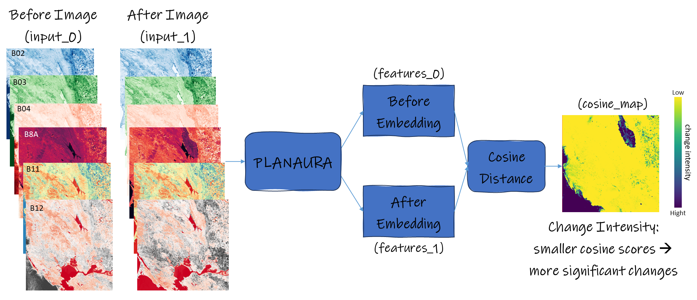

# PLANAURA - Canadian Geospatial Foundation Models

# What is Planaura?

Planaura is a collection of Canadian geospatial foundation models produced at Canada Centre for Mapping and Earth Observation at Natural Resources Canada. 

Planaura is trained with satellite imagery mainly from two sources of harmonized landsat and sentinel (HLS) (https://hls.gsfc.nasa.gov/) 
and sentinel-2 (S2) (https://www.esa.int/Applications/Observing_the_Earth/Copernicus/Sentinel-2).
The training data was selected to provide national coverage over the vast Canadian landscape through 
10 years from 2015 to 2024. The training datasets were mainly acquired over periods 
of June to September in each year, hence making Planaura best performing over spring/summer seasons for most of Canada.

Two versions of Planaura are currently publicly available through HuggingFace.

- Planaura_HLS is best suited to be used with HLS imagery at resolutions of 30 meters.

- Planaura_S2 is best suited to be used with S2 imagery at resolutions of 10-20 meters. 

While Planaura_HLS generalizes well on either
of the data sources (S2 or HLS), the Planaura_S2 model was particularly fine-tuned with higher-resolution data, and 
we have noticed that this specialized model performs slightly better on 10-meter imagery than the 
Planaura_HLS and is able to extract finer levels of change when used for change detection.

HuggingFace Repo: https://huggingface.co/NRCan/Planaura-1.0

Inputs to the model: 
   - In bi-temporal mode (num_frames=2): Two satellite images of the same location taken at two different epochs.
   - In static mode (num_frames=1): One satellite image.
   - Source of imagery can be either Sentinel-2 imagery or Harmonized Landsat and Sentinel imagery.
   - Expected spectral bands of each image (in the order provided below):
     - band 0: blue - B02
     - band 1: green - B03
     - band 2: red - B04
     - band 3: near infrared with central wavelength of 865 nm - B8A
     - band 4: short wave infrared with central wavelength of  1610 nm - B11
     - band 5: short wave infrared with central wavelength of  2190 nm - B12
       
              
Planaura contains a two-epoch (bi-temporal) encoder that facilitates:
   1. Embedding images into feature maps that will be able to represent the descriptive features of each image and can subsequently be used for other tasks like clustering or classification.
   2. Calculating the intensity of change between two images representing the actual contextual changes and not naively the changes of spectral values.

# To prepare the environment for installing Planaura package

Create a conda environment as follows:

    conda create --name planaura python=3.10.9
    conda activate planaura
    conda install gdal==3.6.2

After this, there are two methods to install this package in your environment. 

## Method 1: If you are a developer who plans to change the src:

In this case, you don't want the source to be copied in the environment but rather just the package being created off your own 
src folder that is placed somewhere on your device (whether you copied the src or cloned the main it on your local device)
 (let's say /some_directory/src), then you have to run the setup directly.

To do this, from within the /some_directory folder (in which .toml file and src folder are located),
run the following command:

    pip install -e .[gpu] -c requirements.txt --extra-index-url https://download.pytorch.org/whl/cu116

This will  install the planaura package but will NOT copy its source to the environment. So, in this scenario, 
you won't see a folder planaura in your site-packages. Instead, you will see a dist-info folder which basically 
tells the environment where to find the src of planaura and then will add the path of
your local source (i.e. the /some_directory/src) to the environment's default paths (aka easy-install/editable paths). 
This way is only recommended for dev stages so that when you make changes to source code directly from within your
local src, the environment's package will be automatically updated.

NOTE: If you have another instance of "planaura" package in your environment at a different location, 
go to the site-packages of your environment, find the easy-install path file (name varies but extension is .pth) 
and make sure only the most recent path to planaura's src is there. Otherwise, conflicts may rise. This is specifically
important if several people are working as dev on this repo with this method from within the same environment and machine.

Note than you cannot mix methods 1 and 2.

## Method 2: If you are a user of this package:

Directly install the package into your environment from git by the command:

    pip install "planaura[gpu] @ git+ssh://git@github.com/NRCan/planaura.git" -c requirements.txt --extra-index-url https://download.pytorch.org/whl/cu116

Like any other package installed with pip, a copy of the source from the git repo (only of the files that are included in the package) 
will be made directly 
into your environment like an actual PyPI package would behave. So, if you go to your environment's site-packages 
folder, you should see the package "planaura" with both its dist-info and its source being there. 
So, any time you run a script that imports from planaura, this is the place where it will refer to seek the source code.

# To infer from Planaura

Inference from Planaura can result in two outputs:

   1. The embeddings: These are high-dimensional feature vectors that summarize your images via the Planaura's encoder.
   2. The change map: Defined as cosine similarity map between any two images.

Two sample scripts are provided to help you perform the inference tasks. 

   - /infer_scripts/infer_photo.py: When working with conventional images, this script should be used for inference.
   - /infer_scripts/infer_geotiff.py: When working with geotifs, this script should be used for inference.
     - In this case, if the image pairs passed as inputs to the inference have spatial overlap, 
     then the outputs can optionally be merged into consistent mosaics where the most persistent change is considered to consolidate the results through the overlapping areas.

Each of these scripts should be called along with an appropriate configuration file. 
Two sample configs are provided, one for inference from Planaura_S2 model (planaura_s2_config.yaml) and one for the Planaura_HLS model (planaura_hls_config.yaml). 
The main differences between the two is the checkpoint paths and the data normalization vectors.

In the folder /examples, sample HLS imagery is provided along with an appropriate csv file that you can use to perform an inference demo along with planaura_hls_config.yaml. 
See the section "Sample usage" of this README for more details. You can run the demo like this:

     python infer_geotiff.py <some_directory>/planaura_hls_config.yaml

# Review of the configuration parameters

     - num_frames (int): Planaura best support bi-temporal mode with images of two epochs provided to it as inputs, whic means "num_frames" of 2.
          However, it can also be used in static model with an image of a single epoch provided to it as input, which means "num_frames" of 1.
          Note that if you choose the static mode, then "keep_pos_embeddings" variable of the "model_params" should be changed to False.

     - csv_inference_file (str): full path of a comma-delimited SCV file containing the images you want to use for inference.
          The csv file should have "num_frames" columns, named as input_file_x for x in range(num_frames). So, for example, in bi-temporal
          model with num_frames=2, the csv file must contain two columns of input_file_0 and input_file_1.

     - There are two possibilities when it comes to providing the inputs' csv file.
          - The first and simplest option: for each input image, provide its full path and name.
               In this case, make sure the variable "paths_included_in_csvs" is set to True.
               In this case, you don't provide inference_input_folder_frame_x variables since the paths to input data are already identified in the csv file.
          - The second option: if all input images of each epoch are located in the same folder, you can provide only the names of the image files in the csv file. 
               In this case, make sure the variable "paths_included_in_csvs" is set to False.
               In this case, you have to provide inference_input_folder_frame_x variable to show where the image files of input_file_x can be found.

     - inference_save_folder_frame_x (str): full path to store the inference outcomes of the epoch (aka frame) x, with x being either 0 or 1. 
          If "num_frames" is 2, then you need to provide both inference_save_folder_frame_0 and inference_save_folder_frame_1. 
          If "num_frames" is 1, then you only need to provide inference_save_folder_frame_0.
          Note that if files with similar names as new outputs exist already in these folders, they will be overwritten without a notice.
          DO NOT choose the same folders as your inputs for inference since some similar naming with outputs might happen and input files may get overwritten.

     - use_gpu (bool): if set to true, and your device supports cuda, then inference will be performed using gpu.

     - use_multi_gpu (bool): if set to true, DataParallel will be applied so you can use multiple GPUs for inference. 

     - autocast_float16 (bool): if set to true, then inference will be done in float16.

     - use_xarray (bool):  set to True if you want lazy arrays to be used to open your dataset (as opposed to repetitive direct file I/O calls).
          This is only helpful in speeding up the inference if you want to infer from a very large number of small files, otherwise normal file I/O performs similarly well and even faster.
      
     - data_loader_num_workers (int): number of workers involved in torch data loaders.

     - batch_size (int):  size of a bacth in dataloader.
          Note that if your GPU supports a "batch_size" of N when you set the "patch_stride" to the same value as "patch_size", 
          then you will need to consider a "batch_size" of four times smaller than N to support "patch_stride" of 1.

     - save_reconstructed_images (bool): when an input is forwarded to the model, the decoder of the model estimates the input. This estimation
          is called the reconstructed image. If you need to retain them, set this to true.

     - tif_compression (str): all inference outputs will be stored as tif files. The type of compression can be identified here.
          Valid options are: 'LZW', 'DEFLATE', 'ZSTD', 'NONE'

     - change_map (dict): a set of parameters to determine if and how change-related products should be generated.

          - return (bool): set to true, if you would like change intensity maps (aka cosine maps) to be produced. 
               The rest of the parameters in this dict are applicable if "return" is true.

          - upsample_cosine_map (bool): for cosine map generation you have two choices for the "patch_stride" parameter of the model. 
               If "patch_stride" is set to 1: then the cosine map has originally the same spatial resolution as the input images. This however need considerably more calculations. 
               If "patch_stride" is set to the same value as "patch_size": then the cosine map will have lower resolution; 
               for example a "patch_stride" of 16 means the cosine map will have 16 times lower resolution that the input image. 
               In this second case, if you choose for "upsample_cosine_map" to be false, then the low-res cosine map will be outputted and it will be kept the same. 
               If you choose for "upsample_cosine_map" to be true, then an upsampling interpolation will happen resulting in the cosine maps to have the same resolution as the images. 
               Recommended option is true!

          - save_fmask_layer (bool): set to true if you want the famsk (quality) mosaic to be generated too.
               If you set this true, you need to make sure that for any input_file_x, in the same directory as itself, you do have a file fmask_zzzz where zzzz is the same exact name as the input geotiff.
               This is only applicable to HLS imagery and their quality masks.

          - fmask_in_bit (bool): set to true if your fmask rasters are still in their bitwise representation (as would be a direct download from EarthData).
               Set to false if your fmask rasters are in integer representation with the bit numbers converted to integer as follows:
                    0	Clean
                    1	Cloud
                    2	Adjacent to cloud/shadow
                    3	Cloud shadow
                    4	Snow/ice
                    5	Water	
                    6	High AOT
               Only relevant if save_fmask_layer is set to true.
               
          - save_dates_layer (bool): set to true if you want the dates mosaics to be generated too.
               If you set this true, you need to make sure that your input files have kept the original naming where the date is present in the name according to the "date_regx" string provided in the config.
            
          - date_regex (literal string): This is the regex representation of how we should find the "date" in the input image names.
               For HLS, the proper regex is "\\.(\\d{7})T" and for S2 the proper regex is "\\_(\\d{8})_"
               
     - feature_maps (dict): a set of parameters to determine if and how embedding products should be generated.
          
          - return (bool): set to true if you would like the embeddings of the images to be stored. 
               If true, the embeddings (aka feature maps) will be stored in a csv file where each row corresponds to a pixel of the image and the pixel coordinates along with all the embeddings are provided in the csv file. 
               The rest of the parameters in this dict are applicable if "return" is true. 

          - write_as_image (true): set to true if you would like the embeddings to be presented as an image with N bands, where N is decided based on the "embeddings" parameter.

          - embeddings (list-int): can contain any number between 0 to "embed_dim" of the model to specificy the dimensions of feature maps that will be retained in the output.
               If not provided, all embeddings will be considered.
               In Planaura, the embed dimension of the encoder is 768. It means if all embeddings are being saved, the feature map will be presented as an image with 768 bands. 

     The following parameters are only applicable when inferring from geotiffs:

          - task_list (list-str): the possible items of the list are "infer" and "mosaic"
               If "infer" is in the "task_list", then the  inference process will be done, 
               each image (static mode) or pair of images (bi-temporal mode) identified in your csv_inference_file will be forwarded through the model and their inference outputs will be stored.
               If "mosaic" is in the "task_list", then the results of an inference (either the inference completed by this call if "infer" is in the list too, or done separately if "infer" is not in the list), 
               will be merged into geospatially unified mosaics. 
               These are applicable when inferring from geotiff files.
               As a result of mosaicking, if any of the inference outputs have geospatial overlap, they will be merged considering some criteria. For instance, if change maps are amongst the 
               inference results, then Change Persistence rule will be applied when merging the data. The persistence maps will be produced too. If date layers and fmask quality layers
               are in the inference results too, they will also be mosaicked following the same rule. This way, you will be left with a mosaick
               of change map and you will know each pixel of the map comes exactly from which date and you will also know it was chosen among how many observations (aka persistence count).

          - num_predictions (int): can be 1 or larger. 
               If set to a value larger than 1, then an augmentation at inference in form of shift will happen as many times as the num_predictions.
               This will help incease the confidence of the inference. 
               Note that regardless of the number of "num_predictions", always an overlap of 50% is considered when patching geotiff files for inference and the middle 50% of
               the inference outputs are retained at the end to avoid the inference artifacts that often happen close to the edges of the inputs.
     
          - concatenate_char (str): when creating products from a CSV file containing more than one combination (i.e. more than one pair or one triplet), 
               since all results will be saved in the same folders, it is important to have a unique naming convention. 
               The naming convention will include concatenating the names of each input image using this "concatenate_char". 
               For example if concatenate_char="!", and your first image is "HLS.S30.T13VED.2024001T180919.v2.0.tif" and your second image is "HLS.S30.T13VED.2025001T180919.v2.0",
               then any output will be called "<OUTPUT>!HLS.S30.T13VED.2024001T180919.v2.0!HLS.S30.T13VED.2025001T180919.v2.0", where OUTPUT is the designated product name; for example,
               the change intensity maps are outputted as "cosine_map".
     
          - minimum_valid_percentage (float): for example 0.9 means that if in a patch there is less than 90% valid pixels, that patch won't be processed.
     
          - mosaic_params: dict, a set of parameters that are only applicable to "mosaic" task
     
               - delete_residues (bool): set to true if you want the individual inference outputs contributed to creating the mosaics to be deleted.
     
               - target_crs (str): string in format "EPSG:XXXX" showing the CRS in which you would like the mosaics to be geo-referenced.
     
               - target_resolution (float): the resolution in which you would like the mosaics to be created, defined in the units of "target_crs".
     
               - mosaic_save_postfix (str): a postfix to be used for the generated mosaics names.

     - model_params (dict): configurations used to create the model architecture. When using Planaura weights, do not change any of these parameters unless otherwise indicated.

          - load_params (dict): parameters to load the model weights
               - source (str): "local" or "huggingface". 
                    If set to local, then provide the "checkpoint_path" of the weights on your local device.
                    If set to huggingface, then provide the repo_id and model_name to download the model from huggingface.
              - checkpoint_path (str): full path to the pth file of the model weights on your local device.
              - repo_id (str): huggingface repo id of the Planaura models (i.e. "NRCan/Planaura-1.0")
              - model_name (str): Planaura model name as hosted on huggingface (i.e. "Planaura-1.0-HLS" or "Planaura-1.0-S2")

          - keep_pos_embedding (bool): the position embeddings are applied to both encoder and reconstruction decoder. 
               Set to true when using Planaura in bi-temporal mode.
               Set to false when using Planaura in static model.
          
          - img_size (int): Planaura is trained with image sizes of 512x512 pixels. So, keeping this as 512 is best.
               However, if needed, this can be changes to another value divisible by 16. 
               If this is changed from 512, then "keep_pos_embedding" should become false.
          
          - The followings define the layers architecture and should be kept as is when using Planaura weights.
               - loss: "simple"
               - bands: ["B02", "B03", "B04", "B8A", "B11", "B12"]
               - no_data_float: 0.0001
               - tubelet_size: 1
               - mask_ratio: 0.75
               - depth: 12
               - patch_size: 16
               - embed_attention: true
               - embed_dim: 768
               - num_heads: 12
               - decoder_depth: 8
               - decoder_embed_dim: 512
               - decoder_num_heads: 16

          - patch_stride (int): it can be either 1 or the same value as patch_size.
               If you set the "patch_stride" to the same value as "patch_size" (i.e. 16), the cosine similarity map will have 16 times lower resolution that the input images. 
               If you set the "patch_stride" to 1, then the cosine similarity map will have the same resolution as the input images. 
               However, "patch_stride" of 1 comes with an overhead where the transformer blocks with self-attention mechanism will happen 64 times more times and 4 times more memory will be used compared to when you use "patch_stride" of 16.
               In the planaura_reconstruction.py, under PlanauraReconstructionEncoder forward method, you will find a tensor dataloader (embed_dataloader) that handles this overhead operation. 
               Depending on you GPU(s), you might be able to increase both the batch size and the number of data loader workers to speed up this part of model's forward call.
     
          - no_data (int): For HLS and S2 imagery invalid pixels are identified by the no-data value of -9999
               If you use Planaura with any other source of imagery, enter their respective no-data value here.

          - data_mean (list-float): In the sample config files, the mean values of the training datasets with which each Planaura model is trained are provided. 
               They best contribute to normalizing HLS/S2 imagery.
               If you use Planaura with any other source of imagery, enter their respective means along all their bands here.
          
          - data_std (list-float): In the sample config files, the std values of the training datasets with which each Planaura model is trained are provided. 
               They best contribute to normalizing HLS/S2 imagery.
               If you use Planaura with any other source of imagery, enter their respective stds along all their bands here.
          

# Sample usage

Example data is provided in the folder /examples.

Let's say I have these images of my zone of interest (Jasper area in Alberta, Canada). 
Jasper experienced an unfortunate wildfire in August 2024. 
My goal is to create a change map showing changes from 2023 (before the wildfire) to 2024 (immediately after thewildfire). 

Note how for the HLS data I have fmask quality files too.
If you don't have these, then don't worry (you can set the save_fmask_layer to false).

     2023 images:
          HLS.S30.T11UMU.2023237T185919.v2.tif
          fmask_HLS.S30.T11UMU.2023237T185919.v2.tif
          HLS.S30.T11UMU.2023239T184921.v2.tif
          fmask_HLS.S30.T11UMU.2023239T184921.v2.tif
          HLS.S30.T11UNU.2023237T185919.v2.tif
          fmask_HLS.S30.T11UNU.2023237T185919.v2.tif
          HLS.S30.T11UNU.2023239T184921.v2.tif
          fmask_HLS.S30.T11UNU.2023239T184921.v2.tif
    2024 images:
          HLS.S30.T11UNU.2024249T184919.v2.tif
          fmask_HLS.S30.T11UNU.2024249T184919.v2.tif
          HLS.S30.T11UMU.2024249T184919.v2.tif
          fmask_HLS.S30.T11UMU.2024249T184919.v2.tif

Also assume that I have another HLS mosaic from another source that doesn't follow the original id style of HLS data. 
To add it to my batch of data, I can surely add it as is with its original name. 
However, if my final goal is to merge its results together
with all other inference results using the script infer_geotiff (thus in mode "mosaic"), then 
I should rename it in a way that the part containing the date has the same format (date_regex) as the other inputs. For example, 
let's say my file is originally named as "nocloud_1Sept2024.tif", I could rename it to "nocloud.2024245T.tif"

So, in this example, the list of my images will be:

    2023 images:
          HLS.S30.T11UMU.2023237T185919.v2.tif
          fmask_HLS.S30.T11UMU.2023237T185919.v2.tif
          HLS.S30.T11UMU.2023239T184921.v2.tif
          fmask_HLS.S30.T11UMU.2023239T184921.v2.tif
          HLS.S30.T11UNU.2023237T185919.v2.tif
          fmask_HLS.S30.T11UNU.2023237T185919.v2.tif
          HLS.S30.T11UNU.2023239T184921.v2.tif
          fmask_HLS.S30.T11UNU.2023239T184921.v2.tif
    2024 images:
          HLS.S30.T11UNU.2024249T184919.v2.tif
          fmask_HLS.S30.T11UNU.2024249T184919.v2.tif
          HLS.S30.T11UMU.2024249T184919.v2.tif
          fmask_HLS.S30.T11UMU.2024249T184919.v2.tif
          nocloud.2024245T.tif

Now, in a csv file, I will build pairs out of the before and after images of this area with all possible combinations, like this:

    input_file_0,input_file_1
     HLS.S30.T11UMU.2023237T185919.v2.tif,nocloud.2024245T.tif
     HLS.S30.T11UMU.2023237T185919.v2.tif,HLS.S30.T11UMU.2024249T184919.v2.tif
     HLS.S30.T11UMU.2023239T184921.v2.tif,nocloud.2024245T.tif
     HLS.S30.T11UMU.2023239T184921.v2.tif,HLS.S30.T11UMU.2024249T184919.v2.tif
     HLS.S30.T11UNU.2023237T185919.v2.tif,HLS.S30.T11UNU.2024249T184919.v2.tif
     HLS.S30.T11UNU.2023239T184921.v2.tif,HLS.S30.T11UNU.2024249T184919.v2.tif

Let's place this file on examples/infer_data.csv. Note that I didn't provide the full path of the images, and only their names. Thus, in my config, I have to provide the
directories of the images too.

Now, I decide where I want my inference results to be stored, for example under a folder called "inference" under each of the input folders. 
So, in my Config file, the following tags can be set:

    csv_inference_file: "C:/infer_data.csv"
    inference_input_folder_frame_0: "C:/epoch2023"
    inference_input_folder_frame_1: "C:/epoch2024"
    inference_save_folder_frame_0: "C:/epoch2023/inference"
    inference_save_folder_frame_1: "C:/epoch2024/inference"
    paths_included_in_csvs: false

Note that "inference" folders may not exist now but the program will create them to place the created results in them.
Also note that that if results with same names exist already in these folders, then the new run of the program will overwrite them without any notice.
The rest of the sample config "planaura_hls_config.yaml" can be kept as is for this example and be used to perform inference using script /infer_scripts/infer_geotiff.py.

When this scripts runs, first temporary patches will be created by tiling each pair of files. 
Even if your raster files don't have the same CRS or the sam resolution, or if they have no or partial overlap only, and if they are huge files that don't fit to memory, you don't need to worry because the tiling process will handle all these situations. 
You just have to make sure disk space at the "inference" folders are 
adequate to host these temporary tiles. 

The inference will happen in parallel if batch_size > 1 and using multiple GPUs if selected so.
Then the tiles will merge back using an approach that increases confidence in prediction. 

When this code finishes the "infer" task, for each pair of input_file_0 and input_file_1, a set of before_date, after_date, quality_fmaks, infer_0, infer_1, cosine_map, feature_maps_0, feature_maps_1 tif files as well as
feature_maps_0 and feature_maps_1 csv files will be created.

     epoch2024/inference:

     epoch2023/inference:

The naming of these files will be like this, for example, for the inference results of pair HLS.S30.T11UMU.2023237T185919.v2.tif and nocloud.2024245T.tif:

     All these files all have the same dimensions as the overlap area between HLS.S30.T11UMU.2023237T185919.v2.tif and nocloud.2024245T.tif
          and the same CRS as HLS.S30.T11UMU.2023237T185919.v2.tif.

     since we set "save_reconstructed_images" to true:
          infer_0!HLS.S30.T11UMU.2023237T185919.v2!nocloud.2024245T.tif
          infer_0!HLS.S30.T11UMU.2023237T185919.v2!nocloud.2024245T.tif
               Both have the same resolution as HLS.S30.T11UMU.2023237T185919.v2.
               The order of the bands, the no-data value and the data type are all similar to HLS.S30.T11UMU.2023237T185919.v2.

     since we "change_map->return" to true:
          cosine_map!HLS.S30.T11UMU.2023237T185919.v2!nocloud.2024245T.tif
               Since we had set "change_map->upsample_cosine_map" to true, this file has the same resolution as HLS.S30.T11UMU.2023237T185919.v2.
               It is a single-band float raster with values between -1.0 to 1.0, where smaller values mean more significant changes.
               The no-data value is -100.0.
          
     since we also set "change_map->save_date_layers" to true:
          before_date!HLS.S30.T11UMU.2023237T185919.v2!nocloud.2024245T.tif
          after_date!HLS.S30.T11UMU.2023237T185919.v2!nocloud.2024245T.tif
               These files are temporary and will be only useful for mosaicking.

     since we also set "change_map->save_fmask_layer" to true:
          quality_fmask!HLS.S30.T11UMU.2023237T185919.v2!nocloud.2024245T.tif
               These files are temporary and will be only useful for mosaicking. They consider the worst quality condition across two inputs.

     since we set "feature_maps->return" and "feature_maps->write_as_image" to true:
          feature_maps_0!HLS.S30.T11UMU.2023237T185919.v2!nocloud.2024245T.tif
          feature_maps_1!HLS.S30.T11UMU.2023237T185919.v2!nocloud.2024245T.tif
               Since we had set "change_map->upsample_cosine_map" to true, this file also has the same resolution as HLS.S30.T11UMU.2023237T185919.v2.
               It is a multi-band float raster, with 6 bands since in our example "feature_maps->embeddings" is a list of length 6.
               The no-data value is -100.0.

Then, the "mosaic" process will run. Since we set delete_residues to true, by the end of mosaic process all those  individual files resulted from the infer tasks of 
reconstruction will be deleted.

The following files will be generated by the end of the mosaic process. Note that they have the postfix "example" because we set the "mosaic_params->mosaic_save_postfix" to "example". 

Also note that they all have EPSG:3979 as their CRS and 30 meters as their resolution as specified by the configs "mosaic_params->target_crs" and "mosaic_params->target_resolution".

Also note that all these files will end with "_c" in their names to show that the final cosine map influenced their creation.

Finally note that since we had set "mosaic_params->delete_residues" to true, then all previous individual inference results (Except for the feature_maps csv files) will be deleted.

     epoch2023/inference:

The persistent change intensity map, named as "mosaic_cosine_map_example_c.tif":

The mosaic_cosine_map will be generated by getting the maximum cosine similarity (aka most persistent change) 
for every pixel that have any spatial overlap across all individual cosine maps. The values of cosine_map are float and between -1 and 1 (since a bicubic interpolation
might happen due to change of CRS or resolution, then values slightly larger than 1 or smaller than -1 might be seen too). Values closer to 1 (usually larger than 0.75) 
would indicate no significant change. Values closer to -1 would indicate more significant change.

     change intensity map overlaid on openstreet map:

     change intensity map overlaid on the 2024 mosaic map:

The change persistence count map, named as "mosaic_persistence_example_c.tif":

A mosaic_persistence raster will be created. The data type is integer. For each pixel, it shows the number of times the cosine value was observed at it, 
which means how many valid input pairs overlapped at this pixel. In our example, where all the six pairs of input images overlap, then
the mosaic_persistence would have a value of  6. The mosaic_persistence raster will be
filled with integers between 0 and 6, 
zero meaning that there was no pair of valid input data at that pixel and 6 meaning that there were 6 
pairs of valid input data at that pixel and that the value of mosaic_cosine_map at this pixel was the highest (least changed) amongst all the 6 possibilities.

     change persistence count map overlaid on openstreet map:

The persistent dates, named as "mosaic_before_date_example_c.tif" and "mosaic_after_date_example_c.tif"

mosaic_before_date and mosaic_after_date (containing date as yearDOY, e.g. 2023237) will be generated with 
a postfix "_c" to show you the date of each pixel based on which the final mosaic_cosine_map is determined.

     change persistence 2023 date map overlaid on openstreet map:

     change persistence 2024 date map overlaid on openstreet map:

The persistent inputs, named as "mosaic_before_input_example_c.tif" and "mosaic_after_input_example_c.tif"

mosaic_before_input and mosaic_after_input will show the multi-spectral values of before- and after-images based on which the final mosaic_cosine_map is determined. 

     2023 multispectral input corresponding to the persistent change overlaid on openstreet map:

     2024 multispectral input corresponding to the persistent change overlaid on openstreet map:

The persistent fmask, named as "mosaic_quality_fmask_example_c.tif":

mosaic_quality_fmask mosaic would be produced to show the worst status of clouds or other artifacts (according to the HLS quality mask)
for each pixel (e.g. if there is cloud on either before_input or before_output, the final mosaic_quality_fmsak will show cloud). In this file, the no-data value is 255.
The value 0 means clean, 1 means cloud, 2 means cloud-adjacent,
3 means shadow, 4 means ice/snow and 6 means high-aerosol. 
This way you can cross-validate whether significant changes might be caused by presence of cloud or other fmask artifacts.

     change persistence fmask quality map overlaid on openstreet map:

The reconstructed images, named as "mosaic_infer_0_example_c.tif" and "mosaic_infer_1_example_c.tif":

The same pixels used to determine the mosaic_cosine_map would be selected to determine the final inferred reconstruction pixels in overlapping areas.

     2023 decoder-generated image corresponding to the persistent change overlaid on openstreet map:

     2024 decoder-generated image corresponding to the persistent change overlaid on openstreet map:

The mosaicked feature maps, named as "mosaic_feature_maps_0_example_c.tif" and "mosaic_feature_maps_1_example_c.tif":

These rasters have 6 bands in our example because "feature_maps->embeddings" is a list of length 6, and they show the embeddings extracted from all images at dates corresponding
to the final mosaic_cosine_map.

     2023 encoder-extracted embeddings at dimension 70 corresponding to the persistent change overlaid on openstreet map:

     2024 encoder-extracted embeddings at dimension 70 corresponding to the persistent change overlaid on openstreet map:

# References

See [CONTRIBUTORS.md](./CONTRIBUTORS.md) for a full list of authors and contributors.

The Prithvi-100M model was used as the starting point to create and train Planaura,
to adapt it to Canadian landscape and to make it suitable for bi-epoch multiscale change detection.

        @article{Prithvi-100M-preprint,
            author          = {Jakubik, Johannes and Roy, Sujit and Phillips, C. E. and Fraccaro, Paolo and Godwin, Denys and Zadrozny, Bianca and Szwarcman, Daniela and Gomes, Carlos and Nyirjesy, Gabby and Edwards, Blair and Kimura, Daiki and Simumba, Naomi and Chu, Linsong and Mukkavilli, S. Karthik and Lambhate, Devyani and Das, Kamal and Bangalore, Ranjini and Oliveira, Dario and Muszynski, Michal and Ankur, Kumar and Ramasubramanian, Muthukumaran and Gurung, Iksha and Khallaghi, Sam and Li, Hanxi (Steve) and Cecil, Michael and Ahmadi, Maryam and Kordi, Fatemeh and Alemohammad, Hamed and Maskey, Manil and Ganti, Raghu and Weldemariam, Kommy and Ramachandran, Rahul},
            month           = oct,
            title           = {{Foundation Models for Generalist Geospatial Artificial Intelligence}},
            journal         = {Preprint Available on arxiv:2310.18660},
            year            = {2023}
        }
        
        @misc{Prithvi-100M,
            author          = {Jakubik, Johannes and Chu, Linsong and Fraccaro, Paolo and Gomes, Carlos and Nyirjesy, Gabby and Bangalore, Ranjini and Lambhate, Devyani and Das, Kamal and Oliveira Borges, Dario and Kimura, Daiki and Simumba, Naomi and Szwarcman, Daniela and Muszynski, Michal and Weldemariam, Kommy and Zadrozny, Bianca and Ganti, Raghu and Costa, Carlos and Edwards, Blair & Watson, Campbell and Mukkavilli, Karthik and Schmude, Johannes & Hamann, Hendrik and Robert, Parkin and Roy, Sujit and Phillips, Christopher and Ankur, Kumar and Ramasubramanian, Muthukumaran and Gurung, Iksha and Leong, Wei Ji and Avery, Ryan and Ramachandran, Rahul and Maskey, Manil and Olofossen, Pontus and Fancher, Elizabeth and Lee, Tsengdar and Murphy, Kevin and Duffy, Dan and Little, Mike and Alemohammad, Hamed and Cecil, Michael and Li, Steve and Khallaghi, Sam and Godwin, Denys and Ahmadi, Maryam and Kordi, Fatemeh and Saux, Bertrand and Pastick, Neal and Doucette, Peter and Fleckenstein, Rylie and Luanga, Dalton and Corvin, Alex and Granger, Erwan},
            doi             = {10.57967/hf/0952},
            month           = aug,
            title           = {{Prithvi-100M}},
            repository-code = {https://github.com/NASA-IMPACT/hls-foundation-os},
            year            = {2023}
        }

        @misc{ibm_nasa_geospatial_2023,
            author       = { {IBM NASA Geospatial} },
            title        = { Prithvi-100M (Revision 489bb56) },
            year         = 2023,
            url          = { https://huggingface.co/ibm-nasa-geospatial/Prithvi-100M },
            doi          = { 10.57967/hf/0952 },
            publisher    = { Hugging Face }
        }
    
The idea of using cosine distance between auto-embeddings for change recognition comes from the following publication:

      @article{ruuvzivcka2022ravaen,
        title={RaVEn: unsupervised change detection of extreme events using ML on-board satellites},
        author={R{\uu}{\v{z}}i{\v{c}}ka, V{\'\i}t and Vaughan, Anna and De Martini, Daniele and Fulton, James and Salvatelli, Valentina and Bridges, Chris and Mateo-Garcia, Gonzalo and Zantedeschi, Valentina},
        journal={Scientific reports},
        volume={12},
        number={1},
        pages={16939},
        year={2022},
        publisher={Nature Publishing Group UK London}
      }

Image sources used for training Planaura:

     HLSL30 (Landsat 8 OLI) v2.0: 
          HLS Operational Land Imager Vegetation Indices Daily Global 30m v2.0., 
          distributed by NASA EOSDIS Land Processes Distributed Active Archive Center

     HLSS30 (Sentinel-2 MSI) v2.0: 
          HLS Sentinel-2 Multi-spectral Instrument Vegetation Indices Daily Global 30m v2.0., 
          distributed by NASA EOSDIS Land Processes Distributed Active Archive Center

     Copernicus Sentinel-2 data
          Data retrieved from the Sentinel Hub

# Citation
If you use Planaura in your research, please cite this repository:

     @misc{Planaura_Code_2025,
       author = {Shahbazi, Mozhdeh and Sokolov, Mikhail},
       title = {Planaura - Canadian Geospatial Foundation Models},
       year = {2025},
       publisher = {GitHub},
       url = {https://github.com/NRCan/planaura}
     }

     @misc{Planaura_Model_2025,
       author = {Natural Resources Canada},
       title = {Planaura - Canadian Geospatial Foundation Models},
       year = {2025},
       publisher = {GitHub},
       url = {https://huggingface.co/NRCan/Planaura-1.0}
     }
 