# PLANAURA - Modèles de fondation géospatiaux canadiens

# C'est quoi Planaura ?

Planaura est une collection de modèles de fondation géospatiaux canadiens produits au Centre canadien de cartographie et d’observation de la Terre chez Ressources naturelles Canada.. 

Planaura est entraîné principalement avec des images satellites provenant de deux sources :
- de harmonized landsat and sentinel (HLS) (https://hls.gsfc.nasa.gov/) 
- et de sentinel-2 (S2) (https://www.esa.int/Applications/Observing_the_Earth/Copernicus/Sentinel-2).

Les données d’entraînement ont été sélectionnées pour fournir une couverture nationale du vaste paysage canadien sur une période de 10 ans (2015–2024).
 Les images ont été principalement acquises entre juin et septembre de chaque année, ce qui rend Planaura plus performant au printemps/été pour la majorité du Canada.
 
Deux versions de Planaura sont actuellement disponibles publiquement sur HuggingFace :

- Planaura_HLS qui est mieux optimisé pour les images HLS en résolution spatiale de 30 m

- Planaura_S2 qui est mieux optimisé pour les images S2 en résolution spatiale de 10–20 m 

Bien que Planaura_HLS généralise bien aux deux types (S2 ou HLS), 
 Planaura_S2 a été finement tuné avec des données haute résolution et, donc, montre de meilleures 
 performances pour détecter des changements plus fins qui sont visibles en résolution de 10 m.

HuggingFace Répertoire : https://huggingface.co/NRCan/Planaura-1.0

Les entrées du modèle: 
   - En mode bi-temporel (num_frames = 2) : deux images satellites d’un même endroit, prises à deux dates (epochs) différentes.
   - En mode statique (num_frames = 1) : une seule image satellite..
   - Source des images : Sentinel-2 ou Harmonized Landsat and Sentinel.
   - Les bandes spectrales sont attendues dans l’ordre suivant pour chaque image:
     - bande 0: blue - B02
     - bande 1: vert - B03
     - bande 2: rouge - B04
     - bande 3: NIR (865 nm) - B8A
     - bande 4: SWIR (1610 nm) - B11
     - bande 5: SWIR (2190 nm) - B12
       
              
Planaura contient un encodeur bi‑temporel permettant :
   1. Encoder des images sous forme des cartes de caractéristiques (Embeddings / Features) qui peuvent être utilisées pour d’autres tâches (classification, regroupement, etc.).
   2. Calculer l’intensité des changements entre deux images, en tenant compte du contexte spatial plutôt que d’une simple différence spectrale..

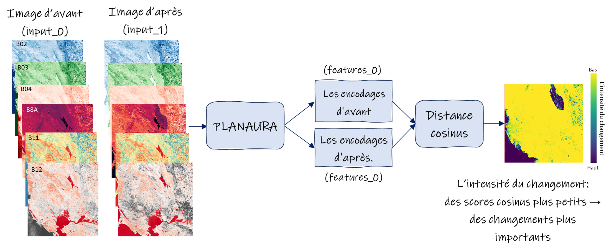

# Préparation de l’environnement pour installer Planaura

Créer un environnement conda:

    conda create --name planaura python=3.10.9
    conda activate planaura
    conda install gdal==3.6.2
    conda remove --force numpy

Maintenant, deux méthodes d’installation existent : 

## Methode 1: pour les développeurs voulant modifier le code source

Placez votre dossier src localement (ex : /some_directory/src) et exécutez cette ligne de command depuis ce dossier:

    pip install -e .[gpu] -c requirements.txt --extra-index-url https://download.pytorch.org/whl/cu116

Cela installera le paquet planaura, mais ne copiera PAS son code source dans votre environnement. Ainsi, dans ce cas,
vous ne verrez pas de dossier planaura dans vos sites-packages.

Cette méthode est recommandée uniquement pour les phases de développement, afin que lorsque vous modifiez le code source directement depuis votre
source locale, le paquet de l'environnement soit automatiquement mis à jour.

NOTE: Ne mélangez jamais les méthodes 1 et 2.

## Method 2: pour les utilisateurs finaux

Installer directement depuis GitHub :

    pip install "planaura[gpu] @ git+https://github.com/NRCan/planaura.git" -c requirements.txt --extra-index-url https://download.pytorch.org/whl/cu116

<b>Important:</b> Le fichier requirements.txt doit être d'abord placé dans le dossier courant du quel vous appelez la commande d'installation.

Comme pour tout autre paquet installé avec pip, 
une copie du code source du dépôt git (uniquement les fichiers inclus dans le paquet sous le dossier src) 
sera directement intégrée à votre environnement, comme le ferait n'import quel paquet PyPI. 

Par conséquent, chaque fois que vous exécuterez un script qui import de `planaura`, c'est à cet emplacement qu'il cherchera le code source.

# Pour effectuer l’inférence avec Planaura

L’inférence avec Planaura peut produire deux types de sorties :

   1. Les encodages : ce sont des vecteurs de caractéristiques de haute dimension qui résument vos images grâce à l’encodeur de Planaura..
   2. La carte de changement : définie comme une carte de similarité cosinus entre deux images.

Deux scripts d’exemple sont fournis pour vous aider à effectuer les tâches d’inférence. 

   - /infer_scripts/infer_photo.py : à utiliser lorsque vous travaillez avec des images conventionnelles.
   - /infer_scripts/infer_geotiff.py : à utiliser lorsque vous travaillez avec des GeoTIFF.
     - Dans ce cas, si les paires d’images fournies en entrée présentent un chevauchement spatial,
	 les sorties peuvent être fusionnées en mosaïques cohérentes, où le changement le plus persistant est utilisé pour consolider 
	 les résultats dans les zones de recouvrement.

Chaque script doit être appelé avec un fichier de configuration approprié. 

Deux fichiers de configuration d’exemple sont fournis; un pour faire l'inference a partir de Planaura_S2 model (planaura_s2_config.yaml) et un autre pour Planaura_HLS model (planaura_hls_config.yaml). 
Les principales différences entre les deux sont les chemins des checkpoints et les vecteurs de normalisation des données..

Dans le dossier /examples, des images HLS d’exemple sont fournies avec un fichier CSV que vous pouvez utiliser pour réaliser une démonstration d’inférence avec planaura_hls_config.yaml.
Voir la section « Exemple d'usage » de ce README pour plus de détails.
 
Si vous avez cloné le dépôt et souhaitez exécuter le script depuis le dossier racine, la ligne de commande ressemble à ceci :

     python infer_scripts/infer_geotiff.py ../planaura_hls_config.yaml

Dans un cas plus général, la commande ressemble à ceci :

     python <path_to_the_script>/infer_geotiff.py <path_to_the_config>/planaura_hls_config.yaml

# Description des paramètres de configuration

     - num_frames (int): Planaura fonctionne de manière optimale en mode bi‑temporel, où deux images provenant de deux dates différentes sont fournies en entrée (c’est‑à‑dire num_frames = 2).
			Il peut toutefois être utilisé en mode statique avec une seule image (num_frames = 1).
			Remarque : En mode statique, la variable keep_pos_embeddings dans model_params doit être réglée sur False..

     - csv_inference_file (str): Chemin complet vers un fichier CSV séparé par des virgules contenant la liste des images utilisées pour l’inférence..
			Le CSV doit comporter un nombre de colonnes égal à num_frames, portant les noms input_file_x  (où x = 0 ou 1). 
			Par Exemple en mode bi‑temporel (num_frames = 2) , Le CSV doit contenir les colonnes input_file_0 et input_file_1.

     - Il y a eux façons de fournir les chemins des images qui sont mentionnées dans le fichier CSV :
			- Option 1 : Chemins complets dans le CSV
				- Chaque entrée du CSV contient un chemin complet vers l’image.
				- Dans ce cas, setter paths_included_in_csvs = True.
				- Les variables inference_input_folder_frame_x ne doivent plus être renseignées.
			- Option 2 : Seulement les noms de fichiers dans le CSV
				- Les images d’une même date sont regroupées dans des dossiers distincts.
				- Le CSV contient seulement les noms des fichiers, sans chemin.
				- Réglez paths_included_in_csvs = False
				- Fournissez les chemins via inference_input_folder_frame_0 et inference_input_folder_frame_1

     - inference_save_folder_frame_x (str): Chemin complet vers le dossier où seront enregistrés les résultats de l’inférence pour l’époque / la frame x (0 ou 1). 
			- Quand num_frames = 2 -> fournir deux chemins
			- Quand num_frames = 1 -> fournir uniquement inference_save_folder_frame_0
			Remarque :  Les fichiers existants portant le même nom que les sorties du programme seront écrasés sans avertissement..
			Remarque :  Ne PAS utiliser les mêmes dossiers que ceux contenant les images d’entrée, pour éviter la risque des écrasements accidentels.
		  
     - use_gpu (bool): Si True et si CUDA est disponible, l’inférence sera effectuée sur GPU.

     - use_multi_gpu (bool): Si True, le programme va utiliser DataParallel pour permettre l’inférence multi‑GPU. 

     - autocast_float16 (bool): Si True, l’inférence est réalisée en float16, ce qui accélère les calculs.
			Disponible uniquement si l’inférence s’exécute sur GPU(s).

     - use_xarray (bool): Réglez à True pour ouvrir les rasters en mode “lazy loading” via Xarray..
			Ce mode améliore  les performances seulement lorsque vous traitez un grand nombre de petits fichiers.
      
     - data_loader_num_workers (int): Nombre de workers utilisés pour les DataLoaders de PyTorch..

     - batch_size (int):  Taille des lots (patchs) traités simultanément.
			À noter que si otre GPU supporte une taille de batch N en utilisant patch_stride = patch_size,
			alors en mode haute résolution (patch_stride = 1), vous devrez réduire le batch à environ N / 4 pour éviter l’épuisement de mémoire.

     - save_reconstructed_images (bool): Si True, les images reconstruites par le décodeur seront enregistrées (generalement pas utile).

     - tif_compression (str): Compression utilisée pour les sorties en format GeoTIFF.
			Les options sont : 'LZW', 'DEFLATE', 'ZSTD', 'NONE'

     - change_map (dict): Paramètres liés à la production des cartes de changement.

			- return (bool): Produire ou non les cartes d’intensité de changement (cosine maps). 
				Les autres paramètres de ce dict ne s’appliquent que si return = True..

			- upsample_cosine_map (bool): 
				Si patch_stride = 1 -> résolution native.
				Si patch_stride = patch_size -> carte de changement basse résolution ( fois patch_size plus bas!).
					Si upsample_cosine_map = True -> interpolation pour restaurer la résolution originale (fortement recommandé).
					Si upsample_cosine_map = False -> garde la carte en basse résolution
					
			- save_fmask_layer (bool): Generer une couche qualité fmask..
               Nécessite la présence d’un fichier fmask_xxx correspondant à chaque image d'entrée.
               Seulement disponibles dans le cas des images HLS.

			- fmask_in_bit (bool): Réglez à True si les masques de qualité sont au format bitwise original.
					Reglez a False s’ils ont déjà été convertis en valeurs entières (0 à 6) selon les valeurs suivants:
                    0 : clair
                    1 : nuage
                    2 : voisin de nuage
                    3 : ombre
                    4 : neige/glace
                    6 : aérosols élevés
               
				Pertinant seulement si save_fmask_layer est regle a True.
               
			- save_dates_layer (bool): Enregistre aussi les couches de dates (avant/après) utilisées pour les mosaïques.
            
			- date_regex (literal string): Expression régulière permettant d’extraire la date apartir des noms de fichiers.
				Pour HLS, le bon regex est "\\.(\\d{7})T" et pour S2 the bon regex est "\\_(\\d{8})_"
               
	 - feature_maps (dict): Paramètres liés à la génération des embeddings / encodages.
          
			- return (bool): Activer la production des embeddings.  
               Les autres paramètres de ce dict ne s’appliquent que si return = True..

			- write_as_csv (bool): Exporter tous les embeddings sous format CSV.
				chaque ligne correspond à un pixel de l'image et les coordonnées du pixel (dans le cas de l'inférence geotif, les coordonnées de la carte) et chaque column corresponds a une dimension de embedding.
				À noter que si patch_strid=1, le fichier va etre très volumineux.

			- write_as_image (bool): Exporter les embeddings sous format d'un image multi-bande.

			- embeddings (list-int): Lister des indices d’embedding à conserver en format image.
				Peux contenir des chiffres entres 0 et "embed_dim" du model (qui est 768 pour Planaura).
				
	 Paramètres spécifiques à l’inférence sur les images en format GeoTIFF:

			- task_list (list-str) : Pourrait contenir "infer" et "mosaic"
				Si « infer » est dans la liste des tâches, le processus d'inférence sera exécuté.
				Chaque image (en mode statique) ou paire d'images (en mode bi-temporel) identifiée dans votre fichier csv_inference_file sera traitée par le modèle et ses résultats d'inférence seront enregistrés.

				Si « mosaic » est dans la liste des tâches, les résultats d'une inférence (soit l'inférence effectuée par cet appel si « infer » est également dans la liste, soit une inférence effectuée séparément si « infer » n'y est pas) seront fusionnés en mosaïques géospatiales unifiées.
				À la suite de la mosaïquage, si des résultats d'inférence présentent un chevauchement géospatial, ils seront fusionnés selon certains critères. Par exemple, si des cartes de changement figurent parmi les résultats d'inférence, la règle de persistance des changements sera appliquée lors de la fusion des données. 
				Donc, les cartes de persistance seront également produites. 
				Si les couches de dates et les couches de qualité fmask sont également présentes dans les résultats d'inférence, elles seront elles aussi mosaïquées selon la même règle. 
				Vous obtiendrez a la fin une mosaïque de la carte des changements, et vous saurez précisément à quelle date correspond chaque pixel de la carte, ainsi que le nombre d'observations pour lesquelles il a été sélectionné (ou nombre de persistances).
          
			- num_predictions (int) : soit 1 oou plus large. Nombre d’augmentations (shifts) appliquées pendant l’inférence pour augmenter la robustesse.
				De toute facon, un chevauchement de 50 % est toujours appliqué aux patchs.

			- concatenate_char (str): Caractère utilisé pour concaténer les noms d’entrées afin de générer des noms de fichiers uniques.
				La convention de nommage des fichiers de sortie consiste à concaténer les noms de chaque image d'entrée à l'aide du caractère « concatenate_char ».
				Par exemple, si concatenate_char="!", et que votre première image est « HLS.S30.T13VED.2024001T180919.v2.0.tif » et votre seconde image « HLS.S30.T13VED.2025001T180919.v2.0 »,
				alors toutes les sortie seront nommées comme « <OUTPUT>!HLS.S30.T13VED.2024001T180919.v2.0!HLS.S30.T13VED.2025001T180919.v2.0 », où OUTPUT est le nom du produit désigné ; 
				par exemple, les cartes d'intensité de changement sont exportées sous le nom « cosine_map ».
     
          - minimum_valid_percentage (float) : Pourcentage minimum de pixels valides requis pour traiter un patch.
     
          - mosaic_params: dict, Paramètres utilisés pour la fusion des résultats et creer des mosaics.
     
				- delete_residues (bool): supprimer les sorties individuelles après la mosaïque.
     
				- target_crs (str): String au format « EPSG:XXXX » indiquant le SCR dans lequel vous souhaitez que les mosaïques soient géoréférencées.
     
				- target_resolution (float) : la résolution dans laquelle vous souhaitez que les mosaïques soient créées, définie dans les unités de « target_crs ».
			   
				- mosaic_save_postfix (str) : suffixe ajouté aux fichiers mosaïqués

	- model_params (dict):  les paramètres de l’architecture du modèle. Ne pas modifier lors de l’usage des poids officiels, sauf indication contraire.

		- load_params (dict): Déterminer la manière de charger les poids du modèle
			- source (str): "local" ou "huggingface". 
				Si l'option « local » est sélectionnée, indiquez le chemin d'accès (« checkpoint_path ») des poids sur votre machine.
				Si l'option « huggingface » est sélectionnée, indiquez l'identifiant du dépôt (repo_id) et le nom du modèle (model_name) pour télécharger le modèle depuis Huggingface. <b>REMARQUE</b> : Si vous êtes derrière un pare-feu, cette option peut ne pas fonctionner. Dans ce cas, téléchargez les poids depuis notre repertoire HuggingFace et utilisez l'option « local ».
			- checkpoint_path (str): chemin local vers le fichier .pth
			- repo_id (str): huggingface repo id de Planaura (i.e. "NRCan/Planaura-1.0")
			- model_name (str): nom du modele sur huggingface (i.e. "Planaura-1.0-HLS" or "Planaura-1.0-S2")

		- keep_pos_embedding (bool): les embeddings de position sont appliqués à la fois à l’encodeur et au décodeur de reconstruction.
			Mettre à true lorsque Planaura est utilisé en mode bi‑temporel.
			Mettre à false lorsque Planaura est utilisé en mode statique.
          
		- img_size (int): Planaura a été entraîné avec des images de 512 × 512 pixels. Il est donc recommandé de conserver la valeur 512.
			Toutefois, si nécessaire, cette valeur peut être changée pour tout nombre divisible par 16.
			Si cette valeur est modifiée (c’est‑à‑dire différente de 512), et alors "keep_pos_embedding" doit devenir false..
          
	`	- Les paramètres suivants définissent l’architecture des couches et doivent être conservés tels quels lors de l’utilisation des poids Planaura.			- loss: "simple"
			- bands: ["B02", "B03", "B04", "B8A", "B11", "B12"]
			- no_data_float: 0.0001
			- tubelet_size: 1
			- mask_ratio: 0.75
			- depth: 12
			- patch_size: 16
			- embed_attention: true
			- embed_dim: 768
			- num_heads: 12
			- decoder_depth: 8
			- decoder_embed_dim: 512
			- decoder_num_heads: 16

			- cette valeur peut être soit 1, soit égale à patch_size.
				Si vous réglez patch_stride à la même valeur que patch_size (par exemple 16), alors la carte de similarité cosinus aura une résolution 16 fois plus faible que celle des images d’entrée.
				Si vous réglez patch_stride à 1, alors la carte de similarité cosinus aura la même résolution que les images d’entrée.

				Cependant, un patch_stride = 1 entraîne une surcharge importante; les blocs transformeurs avec mécanisme d’auto‑attention sont exécutés 64 fois plus souvent,
				et la mémoire utilisée est 4 fois plus élevée comparée à patch_stride = 16.
				
				Dans le fichier planaura_reconstruction.py, dans la méthode forward de PlanauraReconstructionEncoder, vous trouverez un tensor dataloader (embed_dataloader) qui gère cette surcharge de calcul.
				Selon votre ou vos GPU, vous pourrez augmenter à la fois la taille de batch et le nombre de workers du DataLoader pour accélérer cette partie de l’exécution du modèle.

			- no_data (int): pour les images HLS, les pixels invalides sont identifiés par la valeur no‑data = -9999 et pour S2 par la valeur 0.			
				Si vous utilisez Planaura avec une autre source d’imagerie, indiquez ici la valeur no‑data correspondant à cette source.
					
			- data_mean (list-float): dans les fichiers de configuration fournis en exemple, les valeurs moyennes des jeux de données ayant servi à l’entraînement de chaque modèle Planaura sont renseignées. 
				Ces valeurs permettent d’optimiser la normalisation des images HLS/S2.
				Si vous utilisez Planaura avec un autre type d’imagerie, indiquez ici les moyennes correspondantes pour chacune des bandes.
          
			- data_std (list-float): dans les configurations d’exemple, les écarts‑types des jeux de données ayant servi à l’entraînement du modèle sont fournis
				Ils permettent une normalisation adéquate des images HLS/S2.
				Si vous utilisez Planaura avec un autre type d’imagerie, indiquez ici les écarts‑types associés à chacune des bandes.

# Exemple d'usage

En raison de la taille des images d’exemple, nous les avons placées sur Google Cloud :
https://drive.google.com/drive/folders/1QI6CtCN8OSXN7mWpmy1QOIgOY7p3mpz1?usp=sharing

Après avoir téléchargées les données, déplacez‑les dans le dossier /examples.

Supposons que je dispose des images suivantes pour ma zone d’intérêt (la région de Jasper, en Alberta, au Canada).
Jasper a malheureusement été touchée par un important incendie de forêt en août 2024.

Mon objectif est de créer une carte de changement illustrant les changements entre 2023 (avant l’incendie) et 2024 (immédiatement après l’incendie).

Notez que pour les données HLS, je dispose également de fichiers de qualité fmask.
Si vous ne les avez pas, ne vous inquiétez pas — vous pouvez simplement définir "save_fmask_layer" à false..

     2023:
          HLS.S30.T11UMU.2023237T185919.v2.tif
          fmask_HLS.S30.T11UMU.2023237T185919.v2.tif
          HLS.S30.T11UMU.2023239T184921.v2.tif
          fmask_HLS.S30.T11UMU.2023239T184921.v2.tif
          HLS.S30.T11UNU.2023237T185919.v2.tif
          fmask_HLS.S30.T11UNU.2023237T185919.v2.tif
          HLS.S30.T11UNU.2023239T184921.v2.tif
          fmask_HLS.S30.T11UNU.2023239T184921.v2.tif
    2024:
          HLS.S30.T11UNU.2024249T184919.v2.tif
          fmask_HLS.S30.T11UNU.2024249T184919.v2.tif
          HLS.S30.T11UMU.2024249T184919.v2.tif
          fmask_HLS.S30.T11UMU.2024249T184919.v2.tif

Supposons également que je dispose d’une autre mosaïque HLS provenant d’une source différente, et qui ne respecte pas le format d’identifiant original des données HLS.

Pour l’ajouter à mon lot de données, je peux bien sûr l’utiliser telle quelle, avec son nom d’origine.
Cependant, si mon objectif final est de fusionner tous les résultats d’inférence à l’aide du script "infer_geotiff" (donc en mode "mosaic"),
alors je dois renommer le fichier afin que la partie contenant la date respecte le même format ("date_regex") que les autres entrées.
Par exemple, si mon fichier s’appelle initialement "nocloud_1Sept2024.tif", je pourrais le renommer en "nocloud.2024245T.tif".

Et donc, dans cet exemple, la liste de mes images sera la suivante :

    2023:
          HLS.S30.T11UMU.2023237T185919.v2.tif
          fmask_HLS.S30.T11UMU.2023237T185919.v2.tif
          HLS.S30.T11UMU.2023239T184921.v2.tif
          fmask_HLS.S30.T11UMU.2023239T184921.v2.tif
          HLS.S30.T11UNU.2023237T185919.v2.tif
          fmask_HLS.S30.T11UNU.2023237T185919.v2.tif
          HLS.S30.T11UNU.2023239T184921.v2.tif
          fmask_HLS.S30.T11UNU.2023239T184921.v2.tif
    2024:
          HLS.S30.T11UNU.2024249T184919.v2.tif
          fmask_HLS.S30.T11UNU.2024249T184919.v2.tif
          HLS.S30.T11UMU.2024249T184919.v2.tif
          fmask_HLS.S30.T11UMU.2024249T184919.v2.tif
          nocloud.2024245T.tif

Maintenant, dans un fichier CSV, je vais créer des paires à partir des images avant et après, en générant toutes les combinaisons possibles, comme ceci :

    input_file_0,input_file_1
     HLS.S30.T11UMU.2023237T185919.v2.tif,nocloud.2024245T.tif
     HLS.S30.T11UMU.2023237T185919.v2.tif,HLS.S30.T11UMU.2024249T184919.v2.tif
     HLS.S30.T11UMU.2023239T184921.v2.tif,nocloud.2024245T.tif
     HLS.S30.T11UMU.2023239T184921.v2.tif,HLS.S30.T11UMU.2024249T184919.v2.tif
     HLS.S30.T11UNU.2023237T185919.v2.tif,HLS.S30.T11UNU.2024249T184919.v2.tif
     HLS.S30.T11UNU.2023239T184921.v2.tif,HLS.S30.T11UNU.2024249T184919.v2.tif

Plaçons maintenant ce fichier dans examples/infer_data.csv.
Notez que je n’ai pas indiqué le chemin complet des images, mais uniquement leurs noms.
Ca veut dire que dans mon fichier de configuration, je dois donc préciser les répertoires contenant les images.

Maintenant, je décide où je souhaite que les résultats de mon inférence soient enregistrés — par exemple, dans un dossier appelé "inference" situé dans chacun des dossiers d’entrée.

Et donc, dans mon fichier de configuration, les balises suivantes peuvent être définies :

    csv_inference_file: "C:/infer_data.csv"
    inference_input_folder_frame_0: "C:/epoch2023"
    inference_input_folder_frame_1: "C:/epoch2024"
    inference_save_folder_frame_0: "C:/epoch2023/inference"
    inference_save_folder_frame_1: "C:/epoch2024/inference"
    paths_included_in_csvs: false

Notez que les dossiers "inference" peuvent ne pas encore exister, mais le programme les créera automatiquement pour y placer les résultats générés.
Notez également que si des résultats portant les mêmes noms existent déjà dans ces dossiers, une nouvelle exécution du programme les écrasera sans aucun avertissement!

Le reste du fichier de configuration d’exemple "planaura_hls_config.yaml" peut être conservé tel quel pour cet exemple et etre utilisé pour effectuer l’inférence via le script "infer_geotiff.py".

Lorsque ce script s’exécute, des tuiles temporaires sont d’abord créées en découpant chaque paire de fichiers.
Même si vos fichiers raster n’ont pas le même CRS, ou n’ont pas la même résolution, ou ne se chevauchent que partiellement ou ne se chevauchent pas, ou sont trop volumineux pour être chargés en mémoire,
vous n’avez pas à vous en soucier, car le processus de découpage gère automatiquement toutes ces situations.

Vous devez simplement vous assurer que l’espace disque dans les dossiers "inference" est suffisant pour contenir ces tuiles temporaires.

L'inférence sera exécutée en mode parallèle si "batch_size" > 1, et en mode multi_gpu si cette option est activée.
Ensuite, les tuiles seront fusionnées à nouveau en utilisant une approche qui augmente la confiance des prédictions.
Lorsque le programme termine la tâche "infer", un ensemble de fichiers sera créé pour chaque paire input_file_0 et input_file_1, notamment :

	- before_date
	- after_date
	- quality_fmask
	- infer_0
	- infer_1
	- cosine_map
	- feature_maps_0
	- feature_maps_1

tous sous format TIFF, ainsi que :

	- feature_maps_0.csv
	- feature_maps_1.csv
	
Donc, on va avoir ca:

     epoch2024/inference:
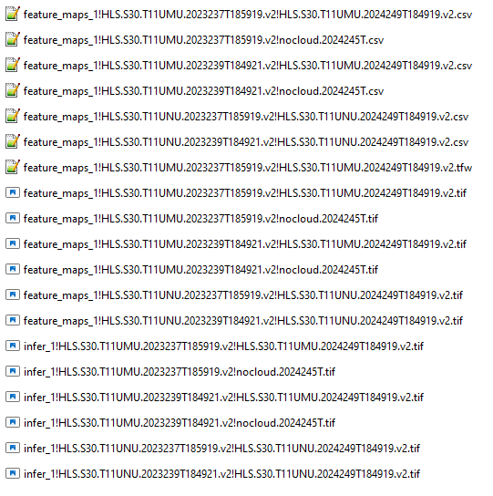

     epoch2023/inference:
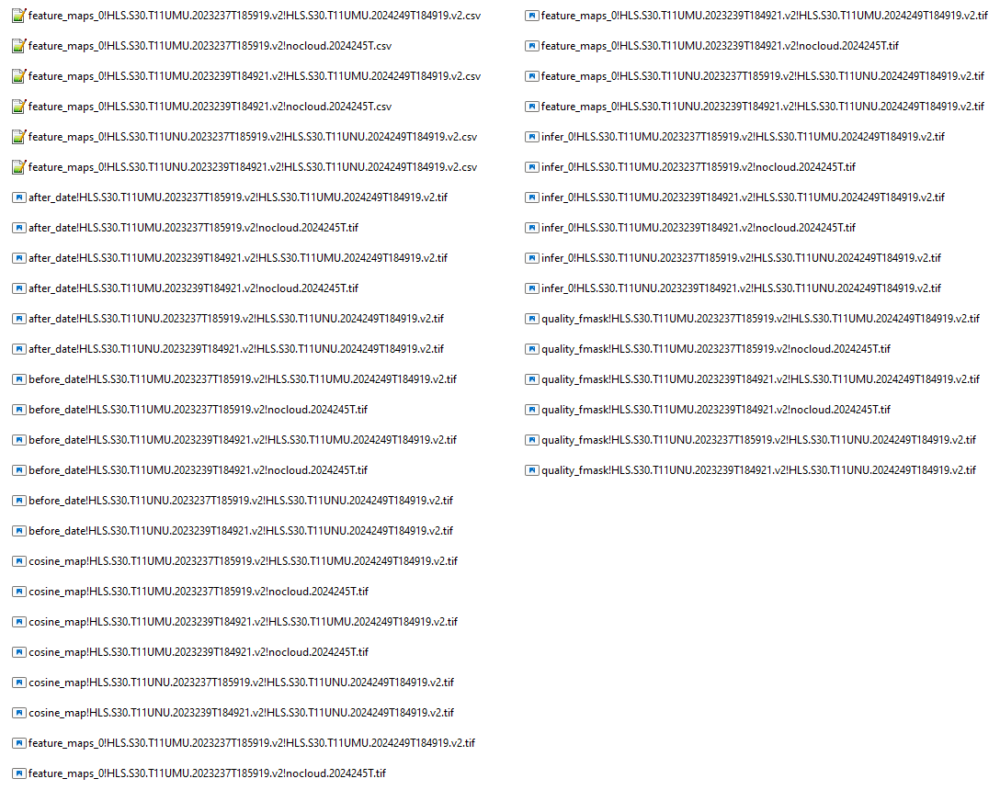

Le nommage de ces fichiers sera le suivant, par exemple pour les résultats d’inférence de la paire
HLS.S30.T11UMU.2023237T185919.v2.tif et nocloud.2024245T.tif :

     Tous ces fichiers ont les mêmes dimensions que la zone de chevauchement entre HLS.S30.T11UMU.2023237T185919.v2.tif et nocloud.2024245T.tif,
		et possèdent le même système de coordonnées (CRS) que HLS.S30.T11UMU.2023237T185919.v2.tif.

     Comme "save_reconstructed_images" est true:
          infer_0!HLS.S30.T11UMU.2023237T185919.v2!nocloud.2024245T.tif
          infer_0!HLS.S30.T11UMU.2023237T185919.v2!nocloud.2024245T.tif
               Elles ont la meme resolution que image HLS.S30.T11UMU.2023237T185919.v2.
               L’ordre des bandes, la valeur no-data et le type de données sont identiques à ceux de l’image HLS.S30.T11UMU.2023237T185919.v2.

     Comme "change_map->return" est true:
          cosine_map!HLS.S30.T11UMU.2023237T185919.v2!nocloud.2024245T.tif
               Comme "change_map->upsample_cosine_map" est true, ce fichier possède la même résolution que HLS.S30.T11UMU.2023237T185919.v2.
               Il s’agit d’un raster float à une seule bande, avec des valeurs comprises entre -1,0 et 1,0 : 
				des valeurs plus petites indiquent des changements plus significatifs ; 
				des valeurs plus proches de 1 indiquent peu ou pas de changement.
			   La valeur de no-data est -100,0.
          
     Comme "change_map->save_date_layers" est true:
          before_date!HLS.S30.T11UMU.2023237T185919.v2!nocloud.2024245T.tif
          after_date!HLS.S30.T11UMU.2023237T185919.v2!nocloud.2024245T.tif
               Ces fichiers sont temporaires et ne servent qu’au processus de mosaïquage.

     Comme "change_map->save_fmask_layer" est true:
          quality_fmask!HLS.S30.T11UMU.2023237T185919.v2!nocloud.2024245T.tif
               Ces fichiers sont temporaires et ne servent qu’au processus de mosaïquage.
			   Ils reflètent la pire qualité rencontrée entre les deux images (selon les fmask de qualité HLS).

     Comme "feature_maps->return" et "feature_maps->write_as_image" sont true:
          feature_maps_0!HLS.S30.T11UMU.2023237T185919.v2!nocloud.2024245T.tif
          feature_maps_1!HLS.S30.T11UMU.2023237T185919.v2!nocloud.2024245T.tif
               Comme "change_map->upsample_cosine_map" était true, ces fichiers ont également la même résolution que l’image d’origine.
			   Ce sont des rasters multi‑bandes de type float, comprenant 6 bandes dans cet exemple (puisque la liste de "feature_maps->embeddings" contient 6 dimensions).
			   La valeur de no‑data est -100,0..

Lorsque le processus "mosaic" s’exécute, les fichiers mosaïqués sont générés.

Comme nous avons défini "mosaic_params->delete_residues" = true, tous les fichiers individuels produits lors des tâches d’inférence et de reconstruction seront supprimés une fois la mosaïque terminée.
Les fichiers suivants seront créés à la fin du processus de mosaïquage.

Notez qu’ils portent tous le suffixe "example", car nous avons réglé "mosaic_params->mosaic_save_postfix" à "example".

Notez également que tous ces fichiers utilisent le CRS de EPSG:3979 et une résolution de 30 mètres, conformément aux paramètres "mosaic_params->target_crs" et "mosaic_params->target_resolution".

Enfin, notez que tous ces fichiers se terminent par "_c", indiquant que la carte de similarité cosinus finale a influencé leur création.

Dernière remarque : puisque nous avons sette "mosaic_params->delete_residues" a true, tous les fichiers individuels issus de l’inférence (sauf les fichiers CSV contenant les feature maps) seront supprimés à la fin du processus de mosaïquage.

     epoch2023/inference:
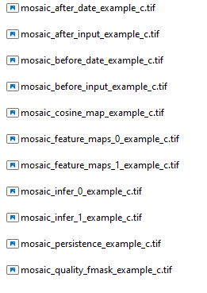

La carte persistante d’intensité du changement, nommée "mosaic_cosine_map_example_c.tif" 

La mosaic_cosine_map est générée en prenant la valeur maximale de similarité cosinus (c’est‑à‑dire le changement le plus persistant)
pour chaque pixel ayant un chevauchement spatial dans l’ensemble des cartes de similarité cosinus individuelles.

Les valeurs d’une cosine_map sont de type float et sont entre ‑1.0 et 1.0.
(Comme une interpolation bicubique peut se produire lors d’un changement de CRS ou de résolution, des valeurs légèrement supérieures à 1 ou inférieures à ‑1 peuvent occasionnellement apparaître.)

Des valeurs proches de 1 (généralement > 0,75) indiquent peu ou pas de changement.
Des valeurs proches de ‑1 indiquent des changements importants.

     Carte d’intensité du changement superposée à OpenStreetMap:
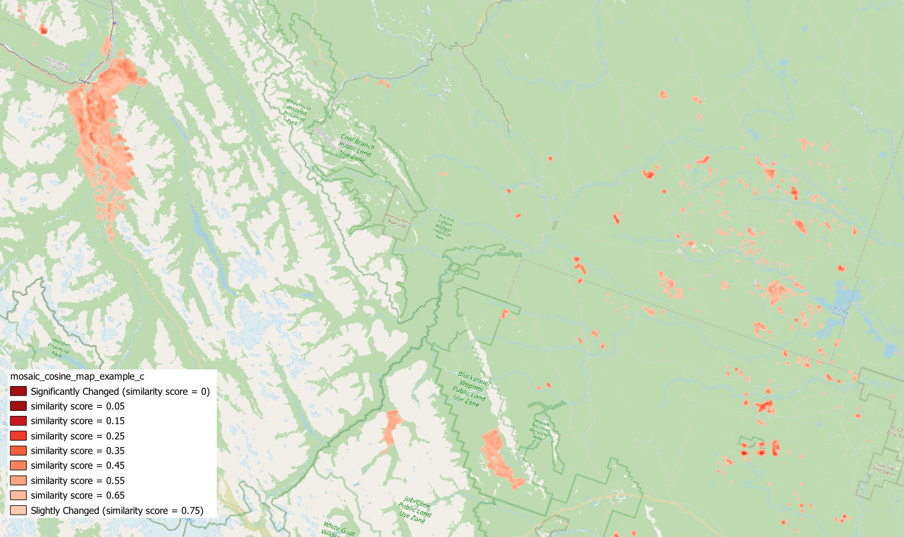

     Carte d’intensité du changement superposée à la mosaïque de 2024:
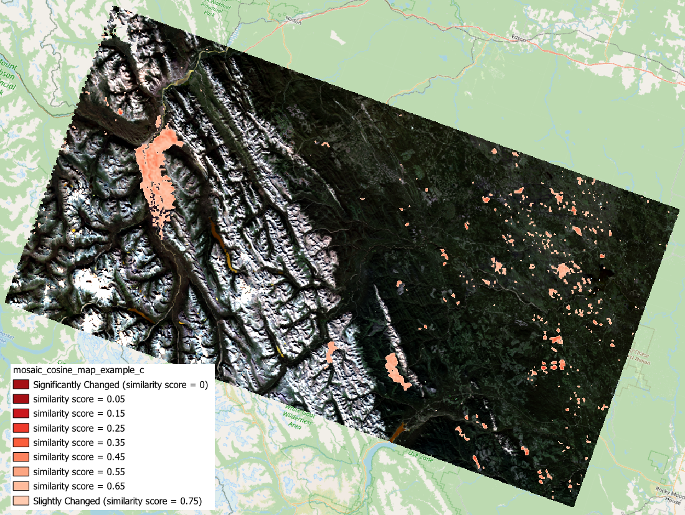

La carte de persistance de l’intensité du changement, nommée "mosaic_persistence_example_c.tif" 

Un raster mosaic_persistence est généré.
Son type de données est entier (integer).
Pour chaque pixel, il indique le nombre de fois où une valeur de similarité cosinus a été observée à cet emplacement — c’est‑à‑dire combien de paires d’images valides 
 se chevauchent sur ce pixel.
Dans notre exemple, où les six paires d’images se chevauchent,
la valeur de mosaic_persistence sera 6.
Le raster sera rempli donc de valeurs entières  entre 0 et 6 : 0 veut dire que aucune paire valide ne couvre ce pixel;
6 veut dire que six paires valides couvrent ce pixel, et la valeur retenue dans mosaic_cosine_map correspond à la plus persistante (celle indiquant le moindre changement) parmi les six possibilités.
     
	 Carte de persistance du changement superposée à OpenStreetMap :
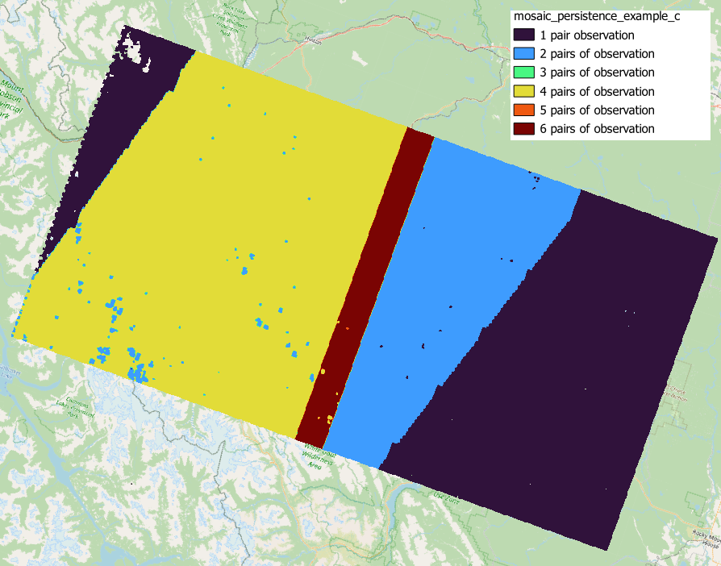

Les dates persistantes, nommées comme "mosaic_before_date_example_c.tif" et "mosaic_after_date_example_c.tif"

Les rasters mosaic_before_date et mosaic_after_date 
(contenant les dates au format année + jour de l’année, ex. : 2023237) 
sont générés avec le suffixe "_c", indiquant qu’ils correspondent aux dates utilisées pour 
déterminer la valeur finale de la mosaic_cosine_map..

     Carte des dates persistantes du changement 2023 superposée à OpenStreetMap:
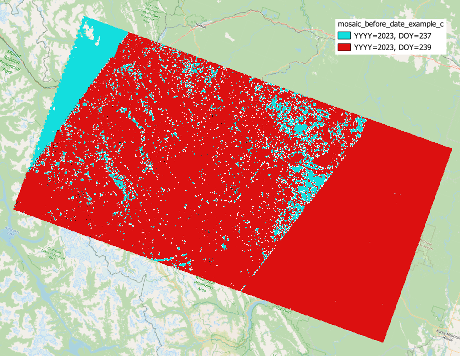

     Carte des dates persistantes du changement 2024 superposée à OpenStreetMap :
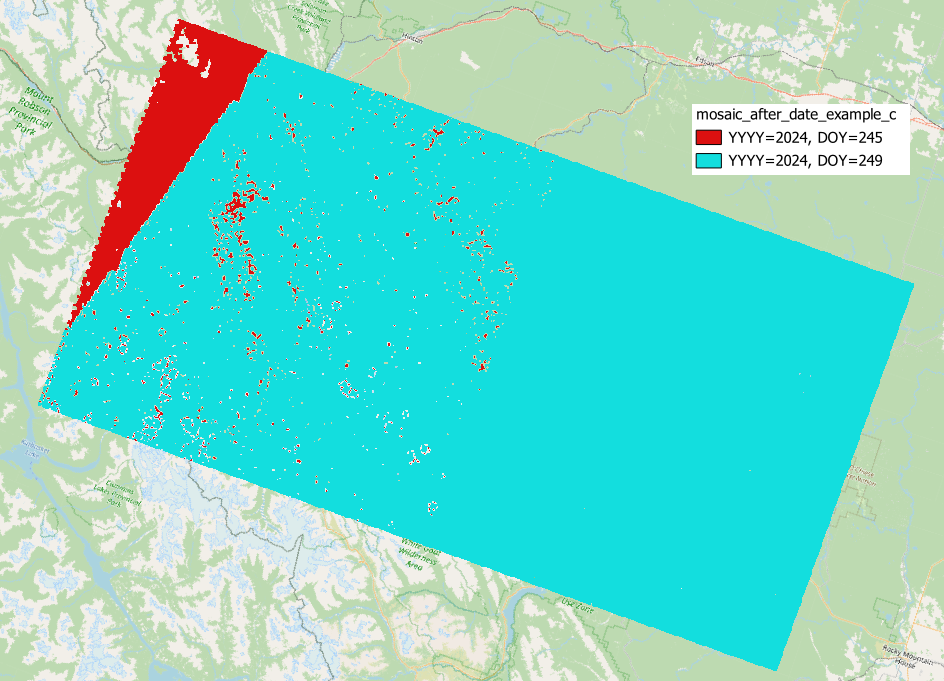

Les entrées persistantes, nommées comme "mosaic_before_input_example_c.tif" et "mosaic_after_input_example_c.tif"

Les rasters mosaic_before_input et mosaic_after_input montrent les valeurs multispectrales des images avant/après utilisées pour déterminer la valeur finale de la mosaic_cosine_map.

     Image multispectrale 2023 correspondant aux changements persistants superposée à OpenStreetMap :
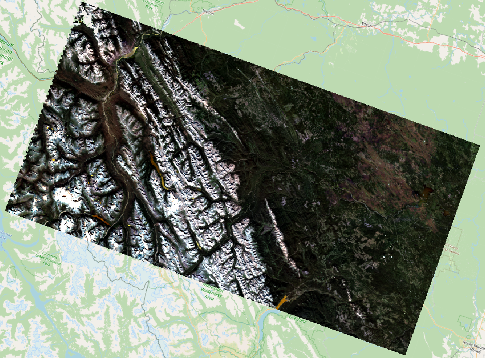

     Image multispectrale 2024 correspondant aux changements persistants superposée à OpenStreetMap :
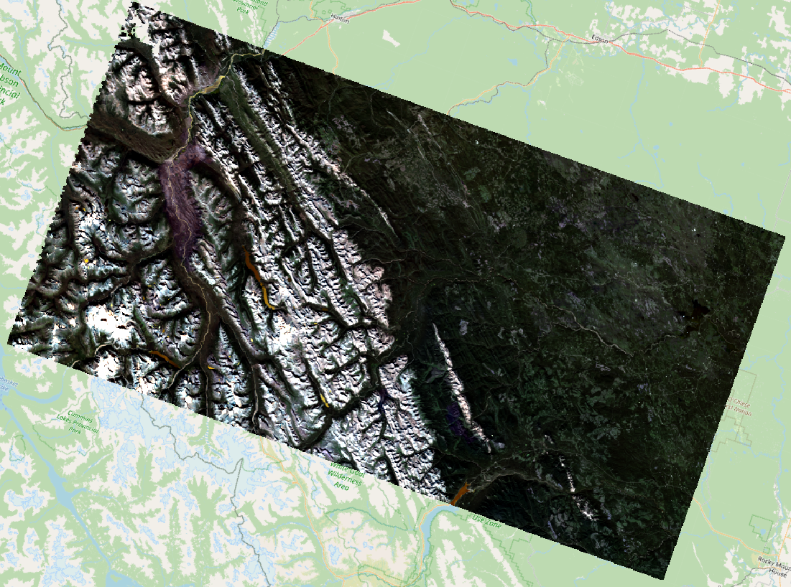

Le masque fmask persistant, nommé comme "mosaic_quality_fmask_example_c.tif":

Le raster mosaic_quality_fmask est généré pour indiquer le pire état de qualité (nuages, ombres, neige/glace, etc.) selon le masque HLS, pour chaque pixel.
Par exemple, si un nuage apparaît dans l’image avant ou dans l’image après, alors le raster persistant indiquera « nuage ».

Dans ce fichier, la valeur no‑data = 255 et les autres valeurs sont 0 (clair), 1 (nuage), 2 (voisin de nuage),
3 (ombre), 4 (neige/glace), et 6 (aérosols élevés).

Cela permet de vérifier si certains changements apparents pourraient être causés par les uages ou d'autres artefacts de masque qualité.

     Carte de qualité fmask persistante superposée à OpenStreetMap:
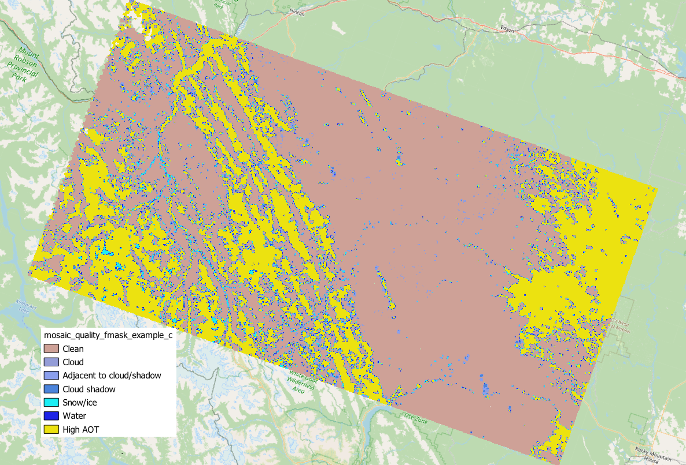

Les images reconstruites, nommées comme "mosaic_infer_0_example_c.tif" and "mosaic_infer_1_example_c.tif"

Les mêmes pixels utilisés pour déterminer la mosaic_cosine_map sont également utilisés pour choisir les pixels reconstruits finaux dans les zones de recouvrement.

     Image reconstruite 2023 superposée à OpenStreetMap:
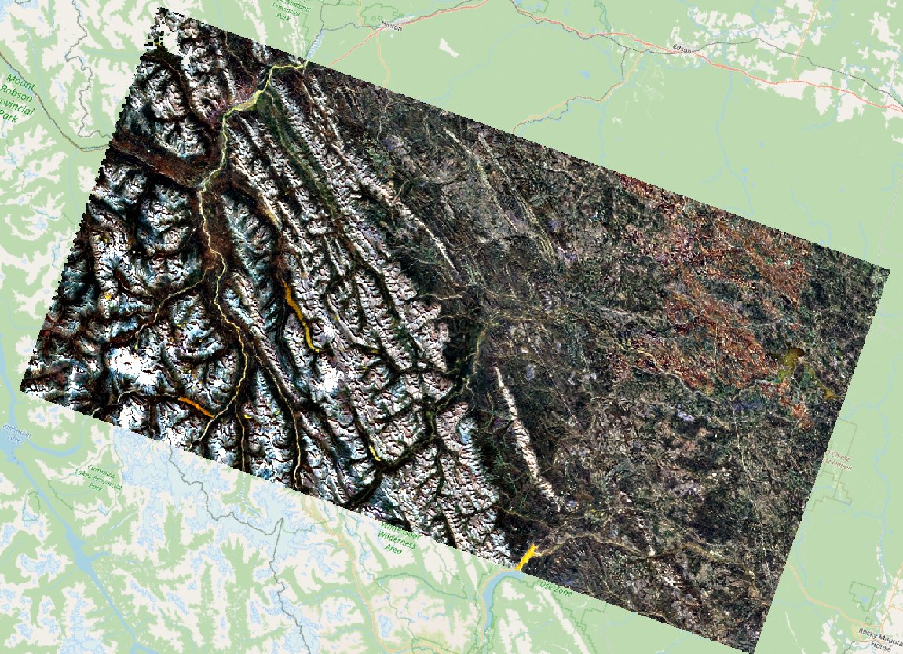

     Image reconstruite 2024 superposée à OpenStreetMap:

Les cartes d’embeddings/encodages/chartertistics mosaïquées, nommées comme "mosaic_feature_maps_0_example_c.tif" et "mosaic_feature_maps_1_example_c.tif"

Ces rasters contiennent 6 bandes dans cet exemple, car la liste "feature_maps->embeddings" comprend 6 dimensions.
Ils montrent les embeddings extraits pour chaque date, correspondant aux pixels utilisés pour produire la mosaic_cosine_map.

     Embeddings 2023 (de la dimension 70) correspondant aux changements persistants superposée à OpenStreetMap:
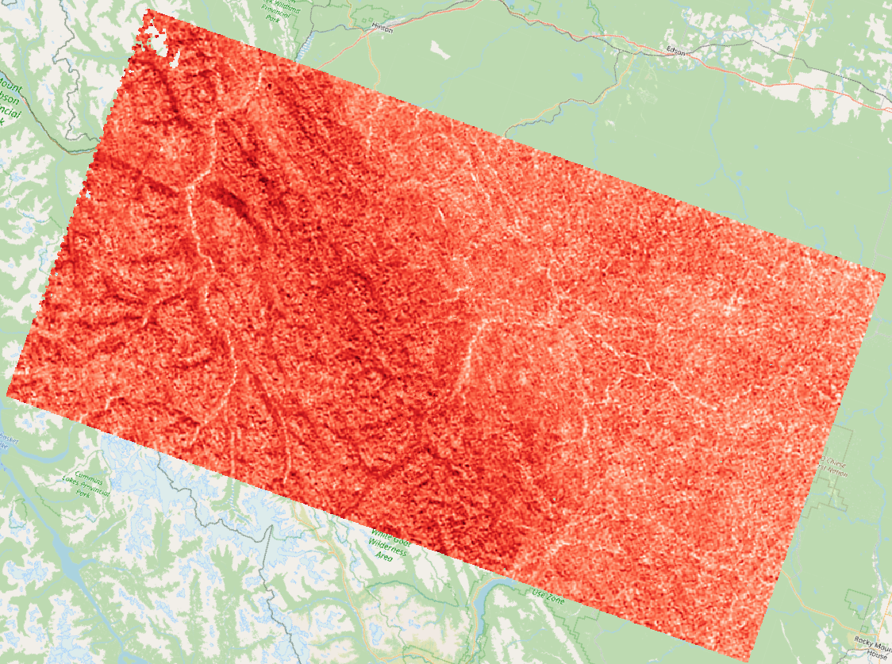

     Embeddings 2024 (de la dimension 70) correspondant aux changements persistants superposée à OpenStreetMap:
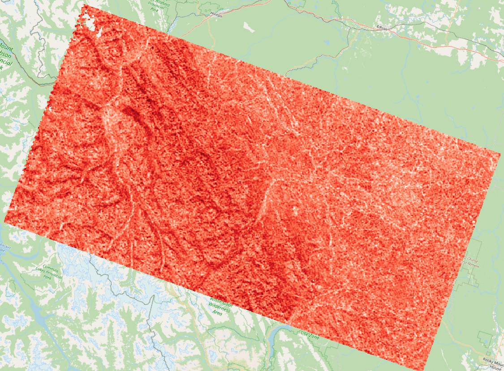

# References

Voir [CONTRIBUTORS.md](./CONTRIBUTORS.md) pour une liste complète des auteurs et des contributeurs.

Le modèle Prithvi‑100M a été utilisé comme point de départ pour créer et entraîner Planaura,
afin de l’adapter au paysage canadien et de le rendre approprié à la détection de changements multi‑échelles et bi‑époques.

        @article{Prithvi-100M-preprint,
            author          = {Jakubik, Johannes and Roy, Sujit and Phillips, C. E. and Fraccaro, Paolo and Godwin, Denys and Zadrozny, Bianca and Szwarcman, Daniela and Gomes, Carlos and Nyirjesy, Gabby and Edwards, Blair and Kimura, Daiki and Simumba, Naomi and Chu, Linsong and Mukkavilli, S. Karthik and Lambhate, Devyani and Das, Kamal and Bangalore, Ranjini and Oliveira, Dario and Muszynski, Michal and Ankur, Kumar and Ramasubramanian, Muthukumaran and Gurung, Iksha and Khallaghi, Sam and Li, Hanxi (Steve) and Cecil, Michael and Ahmadi, Maryam and Kordi, Fatemeh and Alemohammad, Hamed and Maskey, Manil and Ganti, Raghu and Weldemariam, Kommy and Ramachandran, Rahul},
            month           = oct,
            title           = {{Foundation Models for Generalist Geospatial Artificial Intelligence}},
            journal         = {Preprint Available on arxiv:2310.18660},
            year            = {2023}
        }
        
        @misc{Prithvi-100M,
            author          = {Jakubik, Johannes and Chu, Linsong and Fraccaro, Paolo and Gomes, Carlos and Nyirjesy, Gabby and Bangalore, Ranjini and Lambhate, Devyani and Das, Kamal and Oliveira Borges, Dario and Kimura, Daiki and Simumba, Naomi and Szwarcman, Daniela and Muszynski, Michal and Weldemariam, Kommy and Zadrozny, Bianca and Ganti, Raghu and Costa, Carlos and Edwards, Blair & Watson, Campbell and Mukkavilli, Karthik and Schmude, Johannes & Hamann, Hendrik and Robert, Parkin and Roy, Sujit and Phillips, Christopher and Ankur, Kumar and Ramasubramanian, Muthukumaran and Gurung, Iksha and Leong, Wei Ji and Avery, Ryan and Ramachandran, Rahul and Maskey, Manil and Olofossen, Pontus and Fancher, Elizabeth and Lee, Tsengdar and Murphy, Kevin and Duffy, Dan and Little, Mike and Alemohammad, Hamed and Cecil, Michael and Li, Steve and Khallaghi, Sam and Godwin, Denys and Ahmadi, Maryam and Kordi, Fatemeh and Saux, Bertrand and Pastick, Neal and Doucette, Peter and Fleckenstein, Rylie and Luanga, Dalton and Corvin, Alex and Granger, Erwan},
            doi             = {10.57967/hf/0952},
            month           = aug,
            title           = {{Prithvi-100M}},
            repository-code = {https://github.com/NASA-IMPACT/hls-foundation-os},
            year            = {2023}
        }

        @misc{ibm_nasa_geospatial_2023,
            author       = { {IBM NASA Geospatial} },
            title        = { Prithvi-100M (Revision 489bb56) },
            year         = 2023,
            url          = { https://huggingface.co/ibm-nasa-geospatial/Prithvi-100M },
            doi          = { 10.57967/hf/0952 },
            publisher    = { Hugging Face }
        }
    
L’idée d’utiliser la distance cosinus entre des auto‑embeddings pour la détection de changements provient de la publication suivante :

      @article{ruuvzivcka2022ravaen,
        title={RaVEn: unsupervised change detection of extreme events using ML on-board satellites},
        author={R{\uu}{\v{z}}i{\v{c}}ka, V{\'\i}t and Vaughan, Anna and De Martini, Daniele and Fulton, James and Salvatelli, Valentina and Bridges, Chris and Mateo-Garcia, Gonzalo and Zantedeschi, Valentina},
        journal={Scientific reports},
        volume={12},
        number={1},
        pages={16939},
        year={2022},
        publisher={Nature Publishing Group UK London}
      }

Sources d’images utilisées pour l’entraînement de Planaura :

     HLSL30 (Landsat 8 OLI) v2.0: 
          HLS Operational Land Imager Vegetation Indices Daily Global 30m v2.0., 
          distributed by NASA EOSDIS Land Processes Distributed Active Archive Center

     HLSS30 (Sentinel-2 MSI) v2.0: 
          HLS Sentinel-2 Multi-spectral Instrument Vegetation Indices Daily Global 30m v2.0., 
          distributed by NASA EOSDIS Land Processes Distributed Active Archive Center

     Copernicus Sentinel-2 data
          Data retrieved from the Sentinel Hub

# Citation
Si vous utilisez Planaura dans vos recherches, veuillez citer ce répertoire  :

     @misc{Planaura_Code_2025,
       author = {Shahbazi, Mozhdeh and Sokolov, Mikhail},
       title = {Planaura - Canadian Geospatial Foundation Models},
       year = {2025},
       publisher = {GitHub},
       url = {https://github.com/NRCan/planaura}
     }

     @misc{Planaura_Model_2025,
       author = {Natural Resources Canada},
       title = {Planaura - Canadian Geospatial Foundation Models},
       year = {2025},
       publisher = {GitHub},
       url = {https://huggingface.co/NRCan/Planaura-1.0}
     }
 